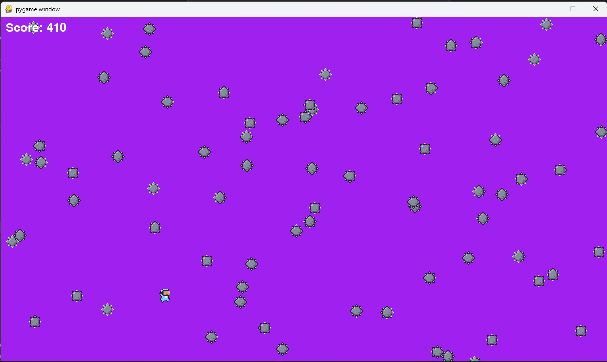
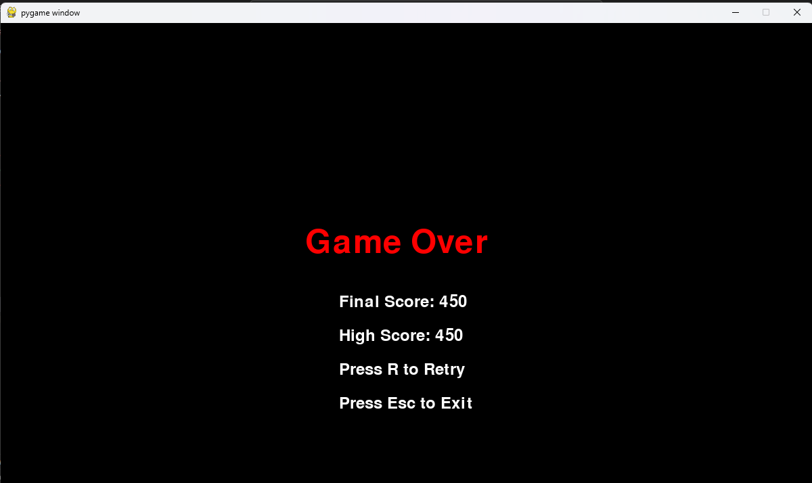

# Projectile Dodge - Python
A mini game of dodging projectiles using Python.

This is a simple game created using Pygame, a popular Python library for game development. The game involves a player which can be controlled in order to avoid falling projectiles while attempting to achieve a high score.

## How to Play

- Use `W, A, S, D` keys to move the player rectangle in different directions.
- Press `Spacebar` to make the player move up quickly for a short distance.
- Avoid the white projectiles falling from the top of the screen. A higher score is achieved the longer the player dodges the projectiles.
- The game ends when the player collides with a projectile and game over screen is displayed.
- Press `R` to retry after a game over.
- Press `Esc` to exit the game.

## Features

- Enhanced visuals with custom sprites for the player and projectiles.
- Dynamic player movement in response to keyboard input.
- Falling projectiles generated at random x-coordinates.
- Collision detection between the player and projectiles.
- Saving and displaying `score` from previous games.
- Game over screen displaying the `final score` and `high score`.
- Retry and exit options on the game over screen.

## Screenshots

Here are some screenshots of the game:




## Dependencies

- Pygame: Make sure to install Pygame using `pip install pygame` before running the game.

## Installation

To play Projectile Dodge, follow these steps:

1. Clone the repository to your local machine:
```
git clone https://github.com/singhkailash9/projectile-dodge-python.git
```

2. Navigate to the project directory:
```
cd projectile-dodge-python
```

3. Install the required dependencies. Make sure you have Python and Pip installed.

    [dependencies](https://github.com/singhkailash9/projectile-dodge-python?tab=readme-ov-file#dependencies)

4. Run the game:
```
python main.py
```

Now you should be able to play Projectile Dodge!

## Contribution

**Any contributions** are greatly appreciated.

Feel free to fork the repo, add/change features and create a pull request.